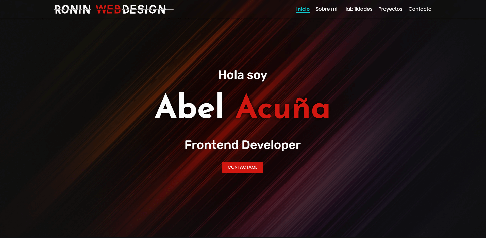

# Portfolio Personal

Este es mi portafolio personal desarrollado con React!

<h1 style='font-size: 3rem; font-family: Poppins; text-align: center'>Ronin WebDesign</h1>

## Descripción del proyecto

¡Hola! Mi nombre es Abel Acuña, un joven apasionado del desarrollo web y la tecnología.

Con sólidos conocimientos en tecnologías Front-End, estoy constantemente actualizándome y profundizando en el uso de React en conjunto con Next JS, una combinación poderosa para crear aplicaciones web modernas y eficientes.

Estoy constantemente buscando oportunidades para crecer profesionalmente y aprender de los mejores en la industria. Siempre me entusiasma asumir nuevos desafíos y enfrentar proyectos interesantes que me permitan seguir evolucionando como desarrollador.

¡Gracias por visitar mi portfolio! Si estás interesado en trabajar juntos o simplemente deseas conocer más sobre mi trabajo, no dudes en contactarme. Estaré encantado de discutir ideas y colaborar en proyectos emocionantes.

## Características principales

- Diseño moderno y atractivo.
- Información sobre mí y mis habilidades.
- Muestra de proyectos destacados.
- Animaciones minimalistas y fluidas con React Awesome Reveal.
- Formulario de contacto para consultas y propuestas de colaboración.

## Tecnologías utilizadas

- HTML 5
- CSS 3
- React - Vite
- Material UI
- Styled Components
- React Awesome Reveal

## Capturas de pantalla

    

## Contacto

Si tienes alguna pregunta o consulta, no dudes en ponerte en contacto conmigo:

- **Teléfono:** +54 9 3858 480489
- **Correo electrónico:** abelalejandro.dev@gmail.com
- **Redes sociales:**

    <a href="https://www.facebook.com/abel.acuna.9">Facebook</a>
    <a href="https://www.instagram.com/abel_alejandro.dev/">Instagram</a>
    <a href="https://www.linkedin.com/in/abel-acu%C3%B1a-roninwebdesign/">LinkedIn</a>  

## Demo

### **Puedes ver la demostración del proyecto [Aqui](https://ronin-webdesign.vercel.app/).**
